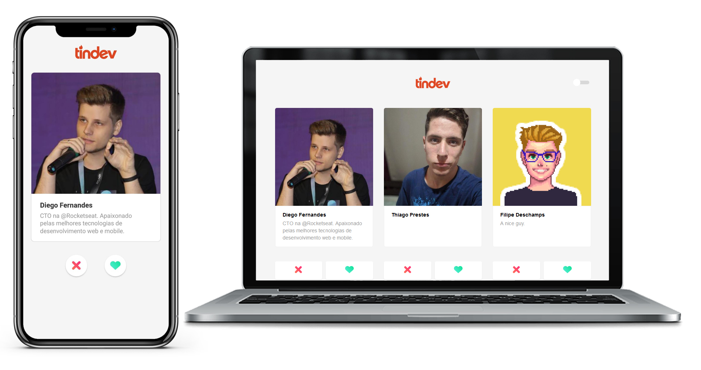

## Tindev

## Sobre o projeto

Projeto desenvolvido durante a semana omnistack 8, com o objetivo de criar uma aplicação semelhante ao tinder porém voltada a devs, com aviso de match entre usuários em tempo real através de websockets utilizando socket.io

### Desenvolvido utilizando

* [React](https://pt-br.reactjs.org/) - Single page application
* [React Native](https://github.com/facebook/react-native) - Aplicativo mobile
* [Express](https://expressjs.com/) - Framework para o node
* [Mongoose](https://mongoosejs.com/) - Comunicação entre o banco de dados e o backend
* [MongoDB](https://www.mongodb.com/) - Banco de dados
* [Socket.io](https://socket.io/) - Comunicação em tempo real entre backend, frontend e mobile
